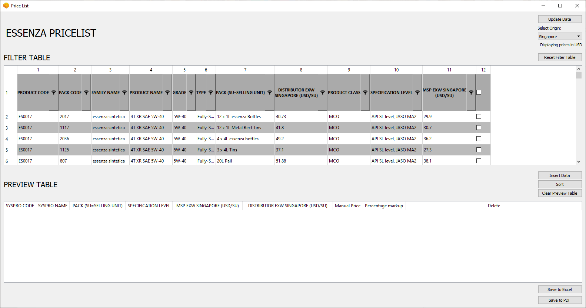
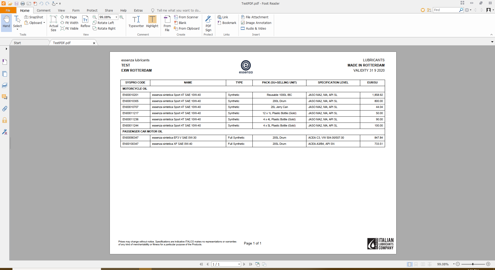

This is a large program that performs multiple functions:

1) It aggregates sales data from multiple excel files (in an external secure server location), sanitizes it and converts it to a csv file to improve performance (ExcelToCsv.vbs does that)
2) It saves the data and categorizes it based on the origin location of the products, it adjusts currency and sales price according to location.
3) In the user interface it shows a filter table where every column can be filtered to find the right products.
4) The products can be added to the preview table and a custom sales price can be selected, a column shows the percentage markup.
5) More rows can be added. Once done, the preview table can be exported to a dynamically formatted pdf file that can be sent to customers.
   The program also orders the products by categories and sub categories according to a master file
   
A settings file can be changed to select the location of the excel files
The excel files have not been uploaded for privacy reasons.
The full libraries have not been uploaded since they can be installed manually.
The standalone executable file does not need to 

Video of program being used: https://youtu.be/ioRYfX2FGLE

Image of Graphical User Interface:

Image of sample output excel file:

